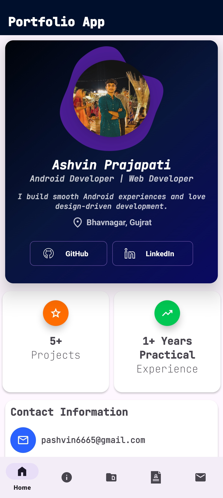
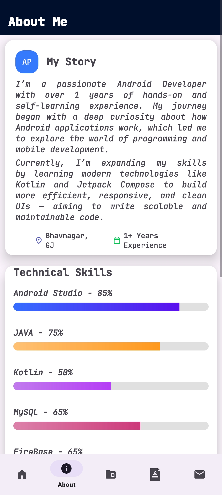
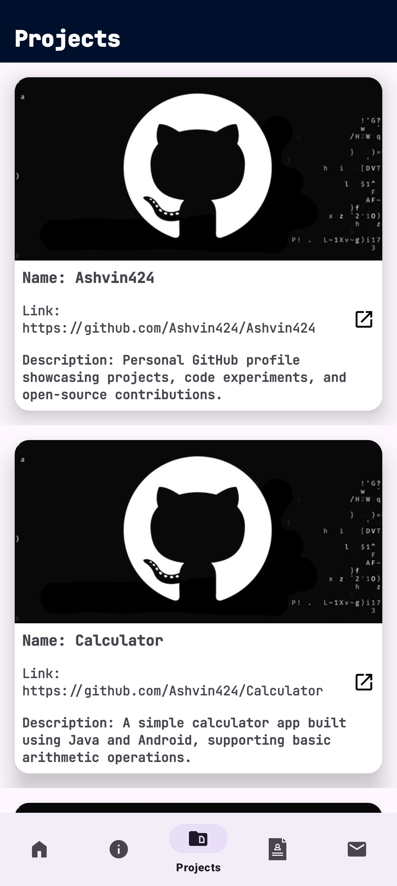
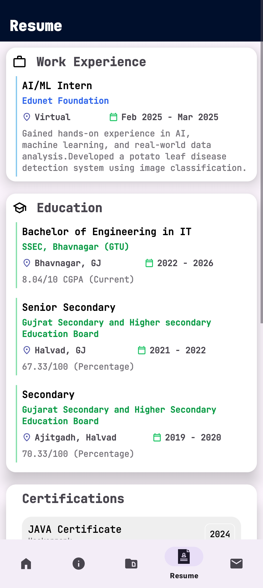
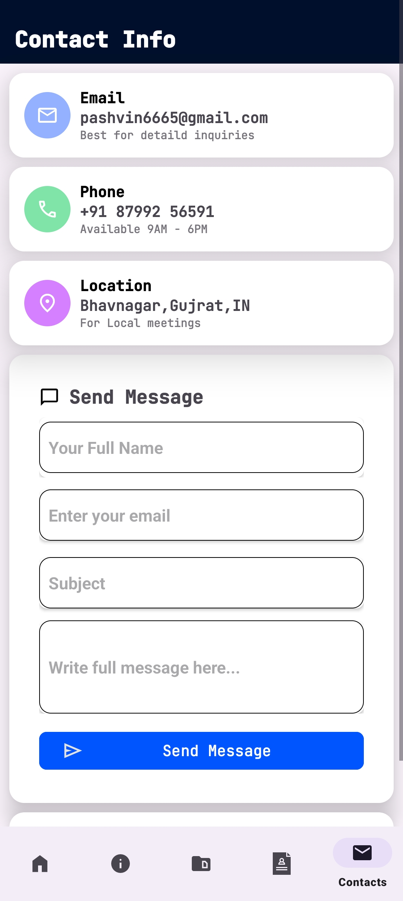

# 📱 Portfolio App

A sleek and modern Android portfolio application built with Java and XML. This app showcases personal projects, enables users to send messages via Firebase Realtime Database, displays animations using Lottie, and integrates GitHub API using OkHttp to dynamically fetch repositories.

---

## ✨ Features

- 🔥 **Lottie Animations** – Engaging animations including blobs and sparkles.
- 📂 **View Projects** – Real-time list of GitHub repositories fetched using the GitHub API.
- 💬 **Contact Form** – Allows users to send messages, stored in Firebase Realtime Database.
- 📄 **Resume Download** – Downloadable resume from within the app.
- 🔗 **API Integration** – Uses OkHttp to call GitHub API and update project listings dynamically.

---

## 📸 Screenshots

| Home Page | About Page | Project Page |
|-----------|-------------|---------------|
|  |  |  |

| Resume Page | Contact Page |
|-------------|----------------|
|  |  |


---

## ⚙️ Tech Stack

- **Frontend**: Java, XML
- **Backend**: Firebase Realtime Database
- **Animation**: Lottie
- **API**: OkHttp for GitHub integration

---

## 🚀 Getting Started

To run the project locally:

1. **Clone the Repository**  
   ```bash
   git clone https://github.com/Ashvin424/Portfolio-App.git

2. **Open in Android Studio**
   
   - Open Android Studio
   
   - Select Open an existing project
   
   - Navigate to the cloned folder and open it

3. **Sync Gradle**
   
   - Android Studio will auto-sync the required dependencies.

5. **Run the App**
   
   - Connect a device or start an emulator, then click Run ▶️.


  ---

  ## 👨‍💻 Author

  **Ashvin Prajapati**
  
  📧 pashvin6665@gmail.com

  🔗 GitHub - Ashvin424

  ---

  💬 Feel free to fork, open issues, or contribute to improve this portfolio app.

  ---
  
   © 2025 Ashvin Prajapati. All rights reserved.
